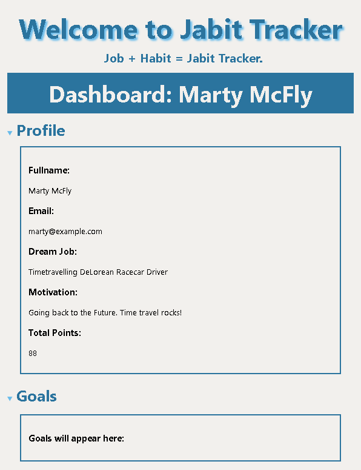

# jabit_tracker_ui

## About
This is the UI repo for Jabit Tracker, a Job Habit Tracker, created for the Troopl Hackathon in Feb 2022

The API for this repo is here - https://github.com/davin2020/jabit_tracker

The idea behind this app is to keep track of job-seeking habits that you can control eg how many applications you submit, or interviews that you attend

## Live Demo
Theres a demo available online at - https://jabit-tracker-ui.herokuapp.com/

## Current Features
- Register a new account
- Login an existing account
- View your personal details on the Dashboard page
- View your goals on the Dashboard page - added 23 Feb

<!-- update image to show goals for Marty -->

## Coming Soon Features
- Add a new goal
- Mark a goal as commpleted
- Delete a goal
- Better styling and layout

## Tech Stack
- Mongo Altas Cloud DB
- Node
- Express
- React
- GraphQL API

## Install Locally
1) Firstly clone this repo locally
2) Run `npm install` to install the project dependencies
3) Run `npm start` to start the UI
FYI at present the UI is hard coded to talk to the live API URL hosted at `https://davin-jabit-api.herokuapp.com/graphql`, but if your running the API locally you can change that to `http://localhost:4033/graphql` in `src/Components/LoginPage/index.js`, `RegisterPage/index.js` and `DashboardPage/index.js`. I had issues with installing dotenv so wasn't able to read in variables from the .env file in order to set the API URL dynamically.

## Getting Started with Create React App

This project was bootstrapped with [Create React App](https://github.com/facebook/create-react-app).

### Available Scripts

In the project directory, you can run:

#### `npm start`

Runs the app in the development mode.\
Open [http://localhost:3000](http://localhost:3000) to view it in your browser.

The page will reload when you make changes.\
You may also see any lint errors in the console.

#### `npm test`

Launches the test runner in the interactive watch mode.\
See the section about [running tests](https://facebook.github.io/create-react-app/docs/running-tests) for more information.

#### `npm run build`

Builds the app for production to the `build` folder.\
It correctly bundles React in production mode and optimizes the build for the best performance.

The build is minified and the filenames include the hashes.\
Your app is ready to be deployed!

See the section about [deployment](https://facebook.github.io/create-react-app/docs/deployment) for more information.
